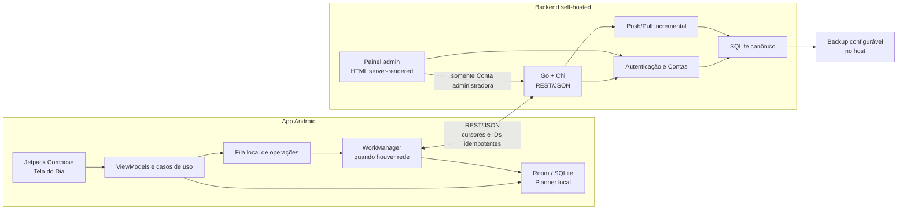
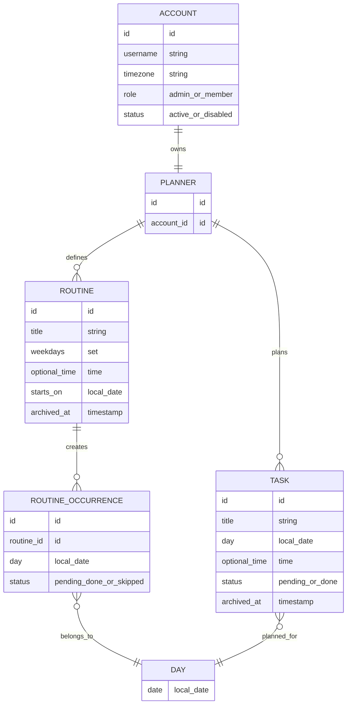

# Planner — arquitetura inicial

Status: decisões validadas na sessão de grill; documento-base para o primeiro vertical slice.

O Planner é um sistema pessoal self-hosted. O primeiro cliente é Android nativo, mas o domínio e a API não dependem do Android. Cada instalação atende várias Contas; cada Conta possui um Planner privado.

## Visão geral



## Módulos do repositório

```text
/
├── android/                 # Kotlin, Compose, Room, WorkManager
├── server/                  # Go, Chi, SQLite, REST e painel admin
├── deploy/                  # Docker Compose, volume e backup
├── docs/adr/                # decisões arquiteturais registradas
└── docs/plans/              # desenhos e planos validados
```

O Android é o cliente principal do Planner. O painel web não é um segundo cliente de planejamento: ele existe apenas para operações administrativas pouco frequentes.

## Domínio



Regras de linguagem e fronteira ficam em [`CONTEXT.md`](../../CONTEXT.md). A Rotina é recorrente por dias da semana e continua até ser pausada/arquivada; cada ocorrência tem estado independente. A Tarefa é pontual, pode ter horário e só muda de Dia por reagendamento manual. O fuso da Conta interpreta datas, horários, recorrências e notificações. A semana começa na segunda-feira.

## Fluxo do Android

### Primeira configuração

1. A pessoa informa a URL do servidor.
2. O app aceita HTTP ou HTTPS; mostra um aviso claro para HTTP.
3. O primeiro login exige conexão.
4. O app baixa a Conta e o Planner, salva a sessão no Android Keystore e cria o banco Room local.
5. Um dispositivo mantém somente uma Conta ativa por vez.

### Uso diário

1. A entrada é a tela do Dia (“Hoje” por padrão).
2. A pessoa troca de Dia por uma faixa de datas; o calendário mensal abre como navegação secundária.
3. Rotinas e Tarefas aparecem em seções separadas.
4. Itens com horário ficam ordenados por horário; itens sem horário ficam em uma seção própria.
5. Concluir ou pular altera apenas o estado local daquele Dia.
6. Criar, editar, reagendar e arquivar funcionam sem internet.

### Sincronização

O Room é a fonte de leitura/escrita da UI. Cada mutação cria uma operação local com ID idempotente. O WorkManager agenda o sync ao abrir/retomar o app, após alterações quando houver rede e por ação manual.

```text
Room + outbox
    │
    ├─ push(operações pendentes, operation_id)
    │       └─ servidor confirma, rejeita ou marca conflito
    │
    └─ pull(cursor)
            └─ servidor devolve mudanças desde o último cursor
```

O backend é canônico por Conta. Em alterações concorrentes, a versão aceita mais recentemente pelo servidor vence. Arquivamento é reversível e viaja como estado/tombstone; não há remoção física no fluxo normal.

Se uma Conta for desativada enquanto o aparelho estiver offline, o app continua localmente até o próximo contato. Ao sincronizar, bloqueia a sessão e torna os dados locais inacessíveis até reativação/login válido.

## API inicial

O contrato é REST/JSON, versionado desde o início (por exemplo, `/api/v1`). O primeiro slice precisa destes grupos:

```text
POST /api/v1/auth/login
POST /api/v1/auth/change-password
POST /api/v1/auth/logout
GET  /api/v1/me

POST /api/v1/sync/push
GET  /api/v1/sync/pull?cursor=...

GET  /admin/accounts
POST /admin/accounts
POST /admin/accounts/{id}/activate
POST /admin/accounts/{id}/disable
POST /admin/accounts/{id}/reset-password

GET  /healthz
```

O primeiro login usa senha temporária definida pelo admin e exige troca. Não há SMTP, convite por e-mail ou recuperação automática no MVP. Senhas são armazenadas apenas como hashes no backend; tokens/sessão do Android ficam no Keystore.

## Painel administrativo

O painel é HTML server-rendered pelo Go, com CSS responsivo e JavaScript mínimo. Só a Conta administradora entra nele. O MVP permite criar Conta, ativar/desativar, redefinir senha, consultar último acesso/última sincronização e sair com segurança. O painel não visualiza nem edita Planners.

## Deploy e operação

O serviço roda em Docker Compose. O SQLite fica em volume persistente fora do ciclo de vida do container. A documentação do deploy inclui uma rotina de backup configurável no host, com pasta e retenção definidas pelo operador.

```text
docker compose up -d
  └── planner-server
        ├── /data/planner.db   (volume persistente)
        └── /data/backups/     (destino configurável)
```

O servidor aceita HTTP e HTTPS para permitir instalações locais sem certificado, mas avisa explicitamente sobre o risco de HTTP. Para servidores acessíveis pela rede, HTTPS é a opção recomendada.

## UI e acessibilidade

- Jetpack Compose, mobile-first.
- Um tema rosa único no MVP, com modo claro e escuro seguindo o sistema.
- Contraste e estados de foco/erro devem permanecer legíveis apesar da paleta rosa.
- Notificações são locais no Android para Tarefas e Rotinas com horário; o backend não envia push no MVP.

## Escopo do primeiro vertical slice

1. Subir o Go/Chi com SQLite, health check e migrações.
2. Criar bootstrap da Conta administradora e login local.
3. Entregar painel admin server-rendered para criar/desativar Conta e redefinir senha.
4. Criar projeto Android Compose com URL configurável, login e sessão Keystore.
5. Criar Room com Planner, Rotina, ocorrência e Tarefa.
6. Entregar tela do Dia com CRUD local de Tarefa e Rotina.
7. Implementar outbox + `sync/push`/`sync/pull` e WorkManager.
8. Empacotar Docker Compose e documentar backup.

## Fora do MVP

Web Planner completo, iOS, colaboração entre Contas, tempo real/WebSocket, e-mail/SMTP, OIDC, temas customizáveis, anexos/PDF/journal, recorrências “a cada N dias”, conflitos manuais, relatórios e SQLCipher.

As decisões irreversíveis ou surpreendentes estão registradas em [`docs/adr/`](../adr/), especialmente offline-first, cliente Kotlin, Go/Chi/SQLite, sync incremental, painel admin e deploy Compose.
